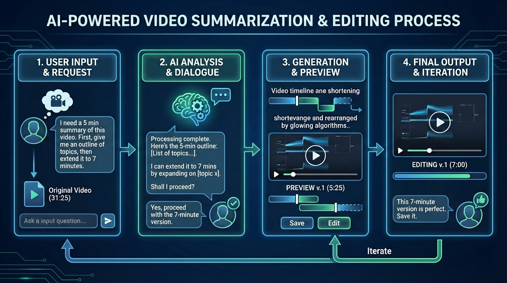
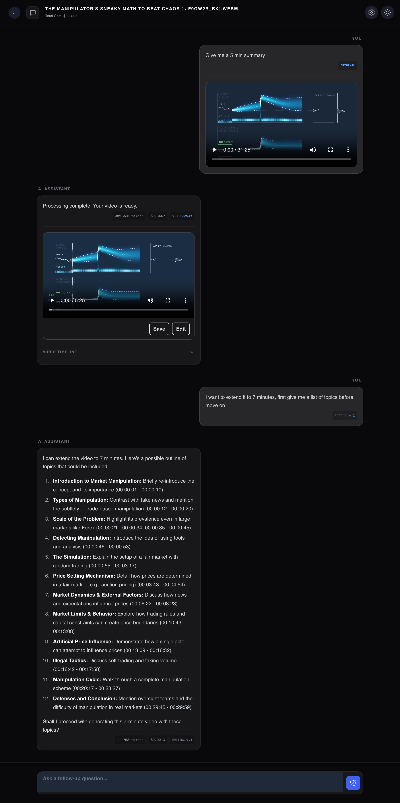

# 🎬 VGTU Video Summarization

---

A high-fidelity platform that transforms long-form video content into concise, meaningful highlights. By leveraging **Google Gemini's** multimodal intelligence and precise **FFmpeg** engineering, it provides a seamless chat-based refinement experience.

**Key Use Cases:**
- 🎓 **Academic Hub**: Condense 2-hour technical lectures into 5-minute study guides.
- 📱 **Content Creation**: Generate social media teasers from raw footage with natural language.
- 🔍 **Quick Review**: Rapidly navigate long meetings or webinars for specific insights.

---
## 🧭 Quick Links & Navigation

| Topic | Resource / Section | Description |
| :--- | :--- | :--- |
| 🏗 **Architecture** | [**Technical Deep-Dive**](./docs/architecture.md) | Pipeline logic, intent nodes, and iterative generation. |
| 🎨 **UI & UX** | [**Design Overview**](./docs/ui_ux.md) | Frontend components, state, and user interaction flow. |
| 🚀 **Setup** | [**Setup Guide**](./docs/setup.md) | Prerequisites and environment installation instructions. |
| 📦 **Repository** | [**Deliverables**](#-deliverables) | Formal project components and file structure. |
| 🧠 **AI Logic** | [**The Pipeline**](#-the-ai-pipeline-highlights) | Logic overview of the 4-phase summarization engine. |
| 🛠 **Verifiability** | [**Reproducibility**](#-reproducibility) | Ensuring consistent results across environments. |
| 📸 **Demo** | [**Final Screenshot**](#-final-snapshot) | Visual overview of the chat and video editor interface. |

---

## 📦 Deliverables
This formal homework project delivers a complete production-grade ecosystem:
*   **Production Code**: Electron desktop app written in Vue 3 & TypeScript.
*   **AI Engine**: A 4-phase pipeline (Extraction, Intent, Generation, Assembly).
*   **Reproduction Tools**: Download the [Sample Videos Folder](https://drive.google.com/drive/folders/1g2Cp533NPQPtngLvnCuP5T8PZNc-FTZK?usp=sharing) (includes full and short versions) and use the app for a 4-phase trace.
*   **Visual Documentation**: Fully documented [Architecture](./docs/architecture.md) and [UI/UX Flow](./docs/ui_ux.md).

---

## 🧠 The AI Pipeline (Highlights)

Our unique **4-Phase Engine** ensures that every summary is contextually accurate:
*   **Intent Recognition**: Uses a "Brain" node to distinguish between chat and generation, preventing token waste.
*   **Iterative Refinement**: Supports an **Edit Mode** that performs a technical "diff" on previous timelines for perfect consistency.
*   **Multimodal Fusion**: Processes visual scene transitions, audio transcripts, and user context simultaneously.

> [!TIP]
> **Deep Dive:** Check out the **[Architecture Deep-Dive](./docs/architecture.md)** for Mermaid diagrams and logic breakdowns.

---

## 🎨 UX Highlights
The interface is designed for **transparency** and **iterative control**:
*   **Version History**: Switch between generated versions instantly to find the best cut.
*   **Live Token Metrics**: Monitor AI usage costs and token counts in real-time.
*   **Zero-Config Preprocessing**: Automatic scene detection and transcript extraction upon upload.

---

## 🛠 Reproducibility
To guarantee identical behavior across different environments:
*   **Sample Data**: Download our [Main Reference Videos Folder](https://drive.google.com/drive/folders/1g2Cp533NPQPtngLvnCuP5T8PZNc-FTZK?usp=sharing) (includes full and short versions) to test the pipeline.
*   **JSON Enforcement**: Strict schemas ensure deterministic AI responses.
*   **Precision Slicing**: FFmpeg settings calibrated for frame-accurate cuts.
*   **Dependency Guard**: Locked environments via `package-lock.json` and `.npmrc`.
*   **Reference Stability**: Edit mode always builds upon a fixed "Seed" timeline to avoid hallucinations.

---

## 🚀 Getting Started
Check the **[Installation & Setup Guide](./docs/setup.md)** to configure:
1.  **Environment**: Node.js and Gemini API Key.
2.  **Tools**: FFmpeg and PySceneDetect for your OS.
3.  **Launch**: `npm install && npm run dev`.

---

## 📸 Final Snapshot

  

---

## 📜 License
Licensed under the MIT License - see [LICENSE](LICENSE) for details.
