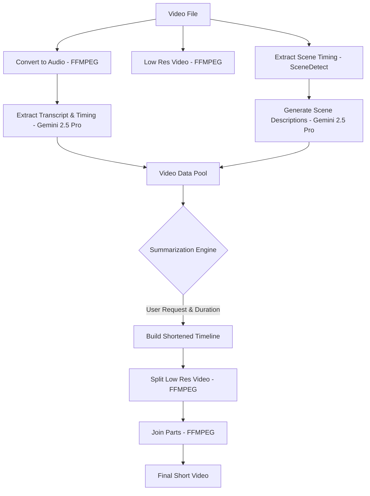

# AI Video Summarizer

A powerful Electron-based application that leverages Google Gemini 2.5 Pro and specialized video processing tools to create intelligent video summaries.

## 🚀 Overview

This tool automates the process of understanding and summarizing video content. It processes video files to extract transcripts and scenes, then uses AI to generate a concise summary video based on user-defined duration and context.

## 🛠️ Key Features

- **API Key Management**: Securely store and use your Google Gemini API key.
- **Intelligent Transcription**: Leverages Gemini 2.5 Pro's native audio capabilities for high-accuracy transcripts.
- **Scene Detection**: Automatically identifies transitions using PySceneDetect.
- **Custom Summaries**: Create summaries based on specific requests (e.g., "Summarize the key takeaways in 30 seconds").
- **Real-time Chat Interface**: Interact with the AI to refine your summary or ask questions about the video.

## 🔄 Workflow

The application follows a robust multi-stage pipeline:



## 💻 Tech Stack

- **Runtime**: [Electron](https://www.electronjs.org/)
- **Frontend**: [Vue.js 3](https://vuejs.org/) with [Pinia](https://pinia.vuejs.org/) for state management.
- **Styling**: [Tailwind CSS](https://tailwindcss.com/)
- **Components**: `@codebridger/lib-vue-components`
- **Processing**:
  - [FFMPEG](https://ffmpeg.org/) for media conversion and editing.
  - [PySceneDetect](https://www.scenedetect.com/cli/) for scene transition analysis.
  - [Google Gemini API](https://ai.google.dev/) for AI-powered understanding and summarization.

## 🚀 Getting Started

### Prerequisites

- [Node.js](https://nodejs.org/) (latest LTS recommended)
- [FFMPEG](https://ffmpeg.org/download.html) installed and in your system PATH.
- [Python](https://www.python.org/) with [PySceneDetect](https://www.scenedetect.com/download/) installed globally.

### Installation

1. Clone the repository:
   ```bash
   git clone https://github.com/navidshad/vgtu-video-summarization.git
   cd vgtu-video-summarization
   ```

2. Install dependencies:
   ```bash
   npm install
   ```

3. Start the development server:
   ```bash
   npm run dev
   ```

## 📜 Available Scripts

- `npm run dev`: Starts the application in development mode with hot-reloading.
- `npm run build`: Builds the application for production.
- `npm run build:mac`: Specifically builds for macOS.
- `npm run lint`: Runs ESLint to check for code quality.
- `npm run format`: Formats the codebase using Prettier.

## 📄 License

This project is licensed under the MIT License - see the [LICENSE](LICENSE) file for details.
