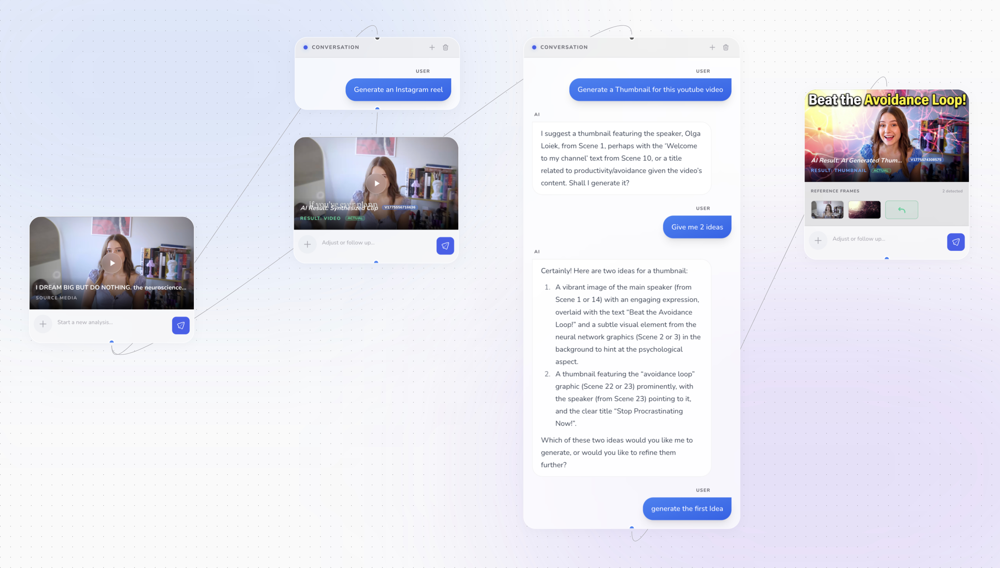
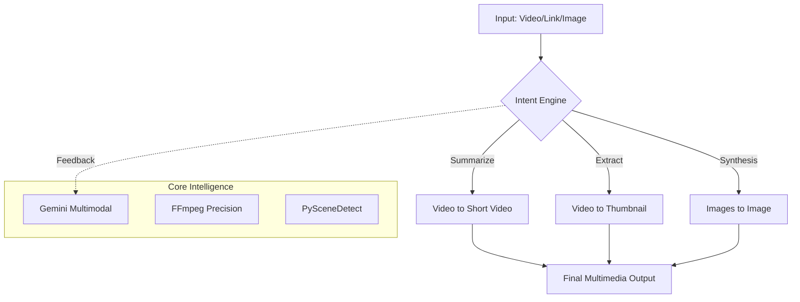
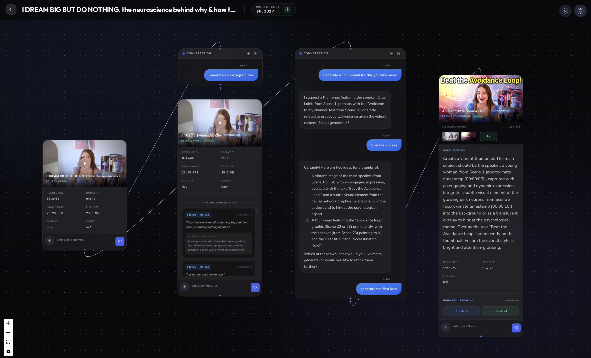

  # 🌊 FrameFlow

  
  
  
  
  

---

  **FrameFlow** is a high-fidelity multimedia platform that bridges the gap between raw video/image assets and creative intelligence. By fusing **Google Gemini's** multimodal brain with precise **FFmpeg** engineering, FrameFlow transforms how you consume, extract, and generate media.

---

## 🚀 The Three Pillars of FrameFlow

FrameFlow is built on three core intelligence layers, designed for creators, researchers, and developers.

### 1. 🎞️ Video to Short Video
Transform long-form content into concise, meaningful highlights.
- **Academic Precision**: Condense 2-hour technical lectures into 5-minute study guides.
- **Meeting Recap**: Rapidly navigate long webinars for specific insights.
- **Narrative Awareness**: AI understands scene transitions and audio context simultaneously.

### 2. 📸 Video to Thumbnail
Extract and generate high-fidelity visual assets from any video source.
- **Auto-Enrichment**: AI analyzes scene quality to extract the most representative frames.
- **Professional Thumbnails**: Generate YouTube-ready or presentation-grade thumbnails with AI-driven composition.
- **Batch Processing**: Extract hundreds of scene-indexed images in seconds.

### 3. 🎨 Images to Image
Leverage multimodal prompts to transform existing images or generate new ones from scratch.
- **Visual Continuity**: Use existing frames as structural references for new generations.
- **Prompt-Driven Flow**: Refine images using natural language within a unified chat-graph interface.
- **Multimodal Fusion**: Combine video context with external image uploads for hybrid creativity.

---

## 🧠 The "Brain" Pipeline

Our unique **4-Phase Engine** ensures that every output is contextually grounded:

```mermaid
graph TD
    A[Input: Video/Link/Image] --> B{Intent Engine}
    B -- Summarize --> C[Video to Short Video]
    B -- Extract --> D[Video to Thumbnail]
    B -- Synthesis --> E[Images to Image]
    C --> F[Final Multimedia Output]
    D --> F
    E --> F
    
    subgraph "Core Intelligence"
    G[Gemini Multimodal]
    H[FFmpeg Precision]
    I[PySceneDetect]
    end
    
    B -. Feedback .-> G
```

---

## 🎨 Premium Experience (UX)

FrameFlow isn't just a tool; it's an iterative workspace:

- **Vue Flow Graph Interface**: Manage parallel tasks and version branches visually.
- **Live Metrics**: Monitor AI token usage and processing costs in real-time.
- **Zero-Config Preprocessing**: Automatic scene detection and transcript extraction.
- **Ambient Design**: A sleek, dark-mode-first interface with glassmorphism and smooth animations.

---

## 🧭 Navigation & Setup

| Section | Link | Purpose |
| :--- | :--- | :--- |
| 🏗 **Architecture** | [**Deep-Dive**](./docs/architecture.md) | Pipeline logic, intent nodes, and iterative generation. |
| 🚀 **Installation** | [**Setup Guide**](./docs/setup.md) | Node.js, Gemini API, FFmpeg, and yt-dlp setup. |
| 🎨 **UI/UX** | [**Design Overview**](./docs/ui_ux.md) | Frontend components and interaction flow. |
| 🛠 **Reproducibility** | [**Sample Data**](https://drive.google.com/drive/folders/1g2Cp533NPQPtngLvnCuP5T8PZNc-FTZK?usp=sharing) | Testing datasets for consistent verification. |

---

## 📸 Interface Preview

  

---

## 📜 License & Credits

FrameFlow is licensed under the **MIT License**. Created by [navidshad](https://github.com/navidshad) and his classmates as part of a high-fidelity AI engineering initiative at Vilnius Gediminas Technical University (VGTU).

---

> [!TIP]
> **Pro Choice:** Check the **[Architecture Deep-Dive](./docs/architecture.md)** to see how we handle multimodal intent recognition and technical "diffs" for consistency.
