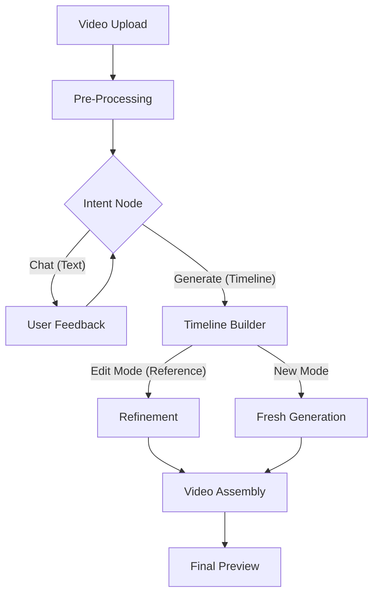

# 🧠 Technical Architecture

This document provides a deep dive into the AI pipeline and technical logic powering this platform.

## 🏗 High-Level Workflow

The application follows a modular, phase-based pipeline to ensure that AI processing is efficient, interactive, and consistent.

---

## 🚦 Phase 1: Pre-Processing
Before any AI logic begins, the system extracts metadata and raw context:
- **Audio Extraction**: FFmpeg extracts audio as MP3 for transcript generation.
- **Scene Detection**: `PySceneDetect` identifies visual boundaries to help the AI "see" the cuts.
- **Multimodal Transcript**: Gemini 1.5/2.0 processes the video and audio to create a timestamped JSON transcript.

## 🧠 Phase 2: The Intent Node ("The Brain")
The **Intent Node** (`src/main/pipeline/phases/intent.ts`) is a gatekeeper that ensures the AI doesn't waste tokens or processing time.
- **Contextual Memory**: It looks at the full conversation history.
- **Direct Commands**: It only triggers generation if the user says "Yes", "Proceed", or gives a specific duration (e.g., "30s highlights").
- **Drafting**: If the user is vague, the Intent Node responds with a *plan* and asks for confirmation.

## 🎞 Phase 3: Timeline Generation
We use two distinct AI strategies implemented in `src/main/timeline/index.ts`:

### 1. Iterative Edit Mode (The "Diff" Engine)
When a user asks to modify an existing summary, the AI is provided with a **REFERENCE TIMELINE**. 
- **Goal**: Maintain maximal consistency with the previous version.
- **Logic**: The AI only changes the segments requested (e.g., "make the middle part shorter") while keeping the rest untouched.

### 2. Recursive Search (New Mode)
For fresh summaries, the AI iteratively selects the "next best segments" from the transcript until the target duration is reached.

## 🛠 Phase 4: Video Assembly (FFmpeg Complex Filter)
Assembly is done in a single high-performance pass:
- **No Temporary Files**: Clips are not saved individually. Instead, a `complexFilter` trims and concatenates them in memory.
- **Sync Control**: Video (`setpts`) and Audio (`asetpts`) streams are synced per segment to prevent drifting.
- **Hardware Acceleration**: Uses `h264_videotoolbox` on macOS for rapid encoding.
