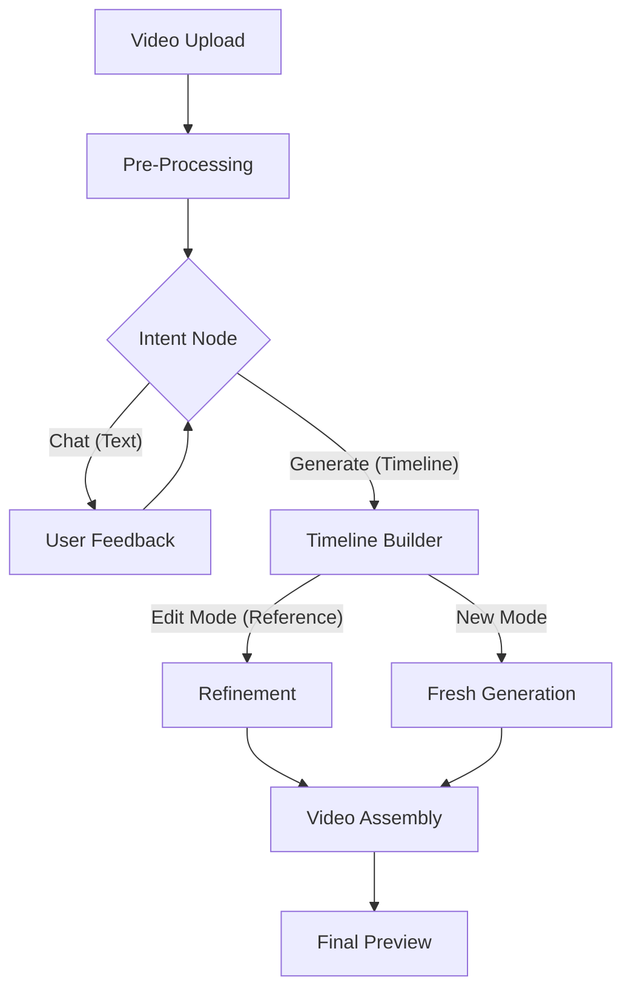
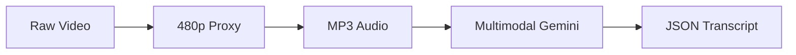
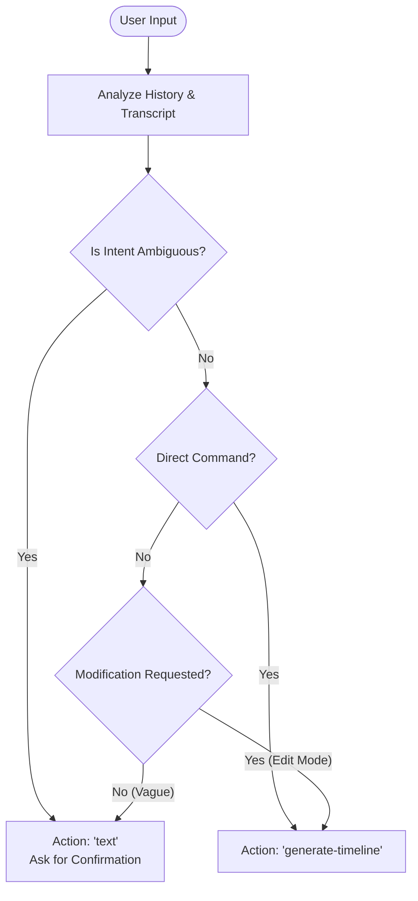
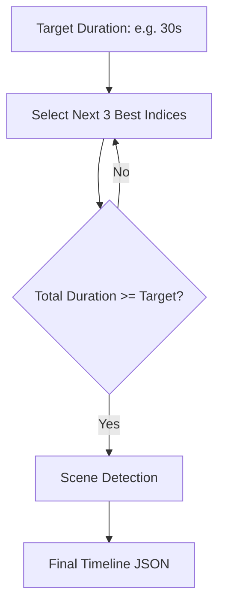
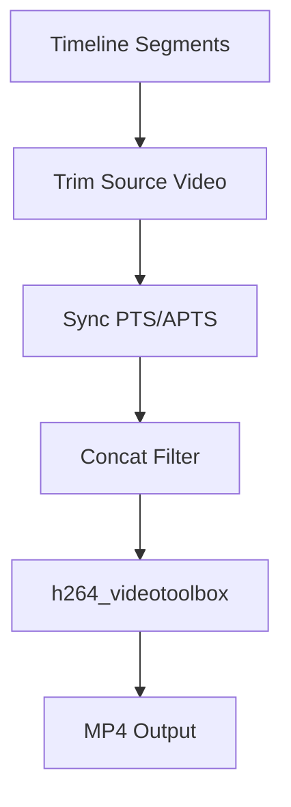

# 🧠 Technical Architecture

This document provides a deep dive into the AI pipeline and technical logic powering this platform.

## 🏗 High-Level Workflow

The application follows a modular, phase-based pipeline to ensure that AI processing is efficient, interactive, and consistent.

---

## 🚦 Phase 1: Pre-Processing Pipeline
The pre-processing phase converts raw video into searchable technical context.

### Technical Workflow:
- **Low-Res Proxy**: Downscales to 480p using FFmpeg for faster AI multimodal processing.
- **Audio Extraction**: Extracts high-quality MP3 for precise transcript timestamping.
- **Transcript Generation**: Gemini 2.5 generates a timestamped JSON object mapping dialogue and events to video indices.

---

## 🧠 Phase 2: The Intent Node ("The Brain")
The **Intent Node** (`src/main/pipeline/phases/intent.ts`) acts as a state machine to manage user expectations.

### Logic Gates:
- **Constraint Enforcement**: NEVER triggers generation for vague phrases like "Make a cool summary."
- **Drafting Mode**: If intent is unclear, it proposes a "Drafting Plan" (e.g., "I will include the first 10s and the ending") and waits for "Yes/Proceed".
- **Reference Awareness**: If a `baseTimeline` exists, it shifts to "Modification" logic, prioritizing consistency.

---

## 🎞 Phase 3: Timeline Generation
We use two distinct AI strategies implemented in `src/main/timeline/index.ts`.

### 1. Iterative Search (New Mode)
For fresh summaries, the AI performs a recursive search to build the timeline segment by segment.

### Scene-Aware Context:
- **Scene Detection**: 
  > [!NOTE]
  > **Future Scope**: Uses `PySceneDetect` to identify hard cuts and transitions. It converts scene segments into descriptive text data, ensuring that the final summary is visually coherent and respects natural scene boundaries.

### 2. Refining Edit Mode (One-Shot "Diff")
When editing, the AI receives the **Reference Timeline** and the **User Request** to produce a single-shot update.
- **Goal**: Maximum index consistency.
- **Logic**: It only replaces indices that conflict with the edit request (e.g., "Remove the part about the cat").

---

## 🛠 Phase 4: Video Assembly (FFmpeg Engine)
Assembly is done in a single high-performance pass using FFmpeg's `complex_filter`.

### Performance Optimizations:
- **Single Pass**: No intermediate files; segments are trimmed and merged in one command.
- **Hardware Acceleration**: Uses `h264_videotoolbox` on macOS for rapid hardware-accelerated encoding.
- **Stream Sync**: Ensures global timestamp consistency (`setpts=PTS-STARTPTS`) to prevent audio drift.

