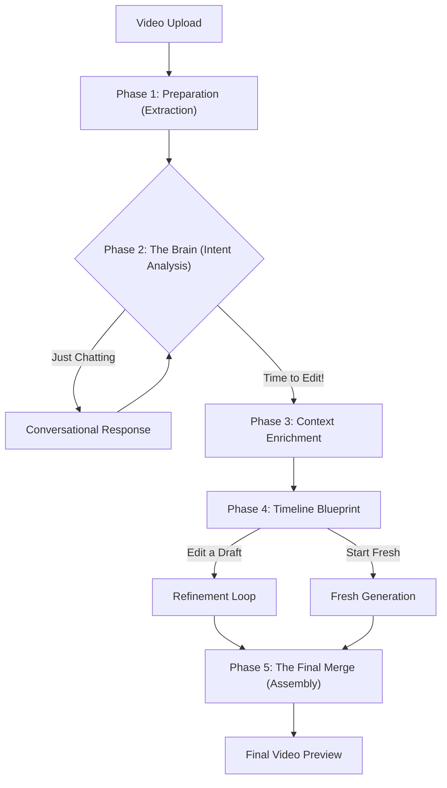

# 🧠 Technical Architecture

Welcome to the technical heart of the **VGTU Video Summarization** project. This document explains how the application turns long videos into concise, AI-edited summaries. It is designed for students, instructors, and developers to understand both the "why" and the "how."

---

## 🌟 Core Concepts

At its simplest, this app acts as an **AI Video Editor**. Unlike traditional editors where you drag clips manually, this system uses a **Pipeline** to automate the process based on your chat instructions.

### 🧩 The Three Pillars
1.  **Vision & Sound (The Input):** We extract audio and frames to "show" the video to the AI.
2.  **The Brain (Gemini AI):** Google's Gemini models analyze the transcript and visual descriptions to decide which parts of the video are important.
3.  **The Engine (FFmpeg & PySceneDetect):** These tools handle the heavy lifting—cutting, merging, and detecting natural breaks (scenes) in the video.

---

## 🏗 High-Level Workflow

The application follows a modular, phase-based pipeline. Think of it like an assembly line:

---

## 🚦 Phase 1: Pre-Processing (Preparation)
Before the AI can "watch" the video, we need to convert it into formats it can understand.

**Key File:** `src/main/pipeline/phases/extraction.ts`

1.  **Low-Res Proxy:** High-quality 4K video is too "heavy" for fast AI analysis. We create a 480p "proxy" version using **FFmpeg**.
2.  **Audio Extraction:** We pull the audio (MP3) because it's much faster for the AI to "listen" to a transcript than to process raw video pixels for every second.
3.  **Raw Transcript:** We use **Gemini 2.5** to generate an initial timestamped script of everything being said.

---

## 🧠 Phase 2: User Intent (The Brain)
When you type a message, the AI needs to decide: *Are you just asking a question, or do you want me to generate a video?*

**Key File:** `src/main/pipeline/phases/intent.ts`

-   **State Machine:** The app doesn't just jump into editing. It checks if your request is clear. If you say "Make it cool," the AI might ask, "What part should be cool?"
-   **Context Awareness:** The AI remembers your previous chat messages so it understands follow-ups like "Actually, make it shorter."

---

## 💎 Phase 3: Context Enrichment (Giving the AI "Eyes")
This is the most critical step. We give the AI a rich "cheat sheet" of what happens in the video.

**Key File:** `src/main/pipeline/phases/extraction.ts`

1.  **Transcript Correction:** Clean up "ums," "ahs," and technical terms in the raw transcript.
2.  **Scene Detection:** Using **PySceneDetect**, we find the exact moments where the camera cuts. This prevents the AI from cutting in the middle of a person's sentence or a visual action.
3.  **Visual Descriptions:** 
    *   We take a "screenshot" (snapshot) of every scene.
    *   **Gemini Flash Lite** writes a short description for each (e.g., *"A student presenting a slide about neural networks"*).
    *   The result is a **Master Timeline** that combines Text + Time + Visuals.

---

## 🎞 Phase 4: Timeline Generation (The Blueprint)
Now, the AI acts as the director. It looks at the enriched context and writes a **Timeline JSON**—a list of start and end times for the final summary.

**Key File:** `src/main/pipeline/phases/generation.ts`

-   **Iterative Search:** The AI searches through the scenes to find the most relevant segments that fit your requested duration (e.g., "Give me a 1-minute summary").
-   **Edit Mode:** If you are editing a previous version, the AI only changes the specific parts you mentioned, keeping the rest of your video intact.

---

## 🛠 Phase 5: Video Assembly (The Factory)
The final step is turning that JSON blueprint into a real video file.

**Key File:** `src/main/pipeline/phases/assembly.ts`

-   **FFmpeg Engine:** We use a "Complex Filter" command. Instead of making many small files and joining them (which is slow), we tell **FFmpeg** to stream-process the original video, cut the pieces, and stitch them in memory.
-   **Hardware Secrets:** On Mac, we use `h264_videotoolbox` to use the computer's graphics chip, making the export 5-10x faster.

---

## 🎓 Instructor & Student FAQ

### Why use a proxy video?
Processing a 1GB 4K file directly for AI descriptions would be slow and expensive. A 480p proxy looks the same to the AI but processes in seconds.

### How does it handle "Hallucinations"?
The AI creates a **Blueprint** (JSON) first. The app validates this blueprint against the actual video duration before a single frame is cut.

### What happens if I edit a summary?
We use a "Reference Timeline" system. The AI compares your request against the *existing* edit, behaving like a human editor who only changes the clips you pointed out.
