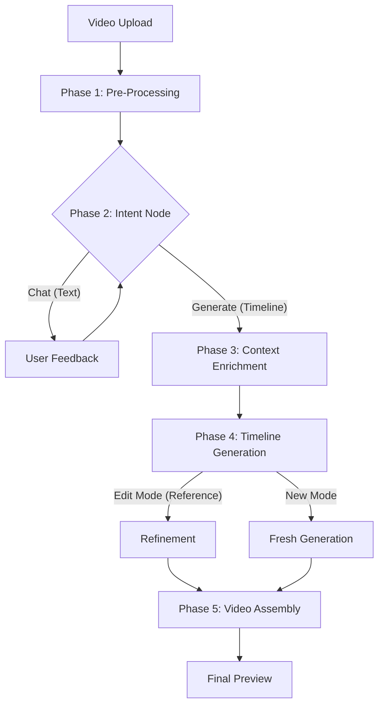
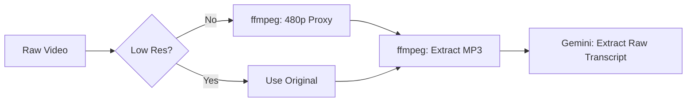
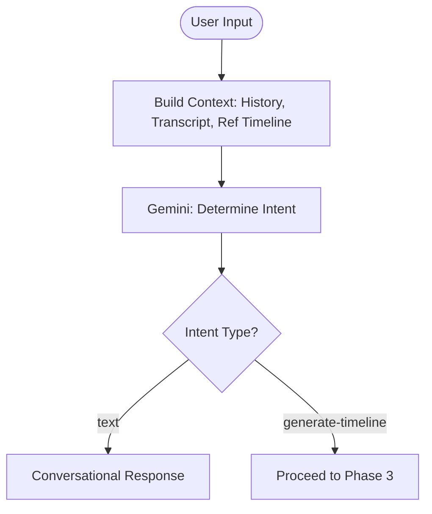
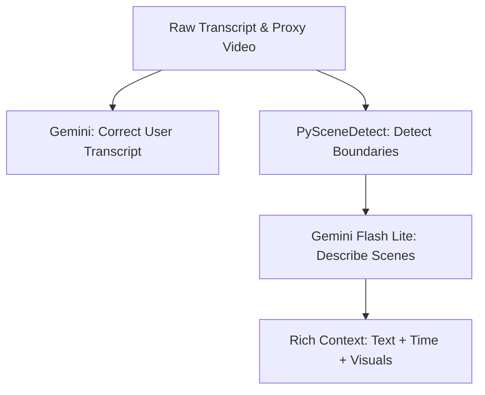
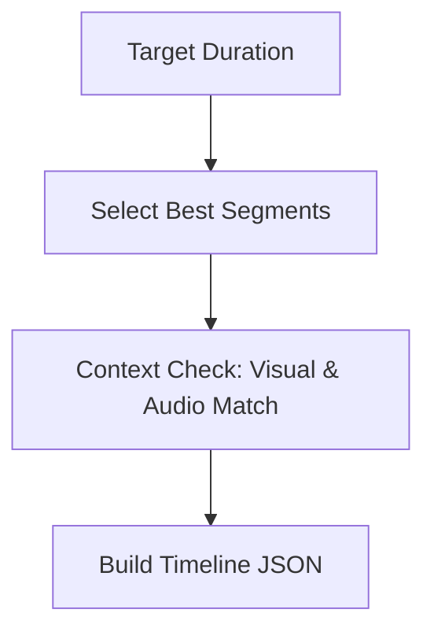
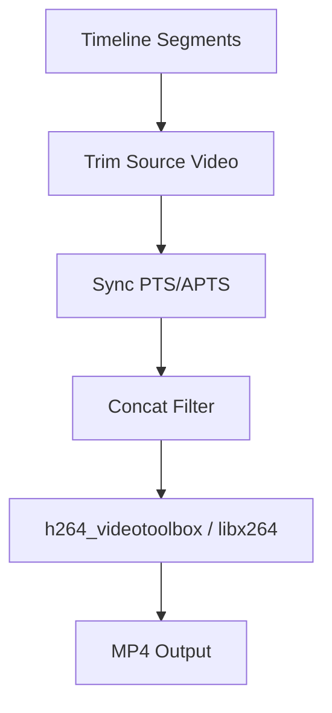

# 🧠 Technical Architecture

This document provides a deep dive into the AI pipeline and technical logic powering this platform.

## 🏗 High-Level Workflow

The application follows a modular, phase-based pipeline (`src/main/pipeline`) to ensure that AI processing is efficient, interactive, and consistent.

---

## 🚦 Phase 1: Pre-Processing Pipeline
The pre-processing phase converting raw video into workable assets.

**Code:** `src/main/pipeline/phases/extraction.ts`

### Technical Workflow:
1.  **Low-Res Proxy** (`ensureLowResolution`): Checks video resolution. If high-res, downscales to 480p using FFmpeg. This proxy is used for visual analysis steps to curb token usage and latency.
2.  **Audio Extraction** (`convertToAudio`): Extracts audio to MP3 for transcript generation.
3.  **Raw Transcript** (`extractRawTranscript`): Uses Gemini 2.5 to generate an initial timestamped JSON transcript from the audio.

---

## 🧠 Phase 2: The Intent Node ("The Brain")
The **Intent Node** acts as a state machine to manage user expectations and control the flow of the pipeline.

**Code:** `src/main/pipeline/phases/intent.ts`

### Logic Gates:
-   **Conversation vs. Action**: Distinguishes between exploring ideas ("text") and explicit commands ("generate-timeline").
-   **Constraint Enforcement**: System prompts prevent premature generation for vague requests (e.g., "Make a summary" -> asks for clarification).
-   **Reference Awareness**: If a `baseTimeline` exists (Edit Mode), the intent analysis considers it to understand requests like "remove the second clip."

---

## 💎 Phase 3: Context Enrichment
Once intent is confirmed, we enrich the data before generating the timeline. This ensures the AI editor has "eyes" and "ears" perfectly synced.

**Code:** `src/main/pipeline/phases/extraction.ts`

### Steps:
1.  **Transcript Correction** (`extractCorrectedTranscript`): Refines the raw transcript for accuracy, correcting potential mishearings using a second pass if needed.
2.  **Scene Internal Timing** (`extractSceneTiming`): Uses `PySceneDetect` (via CLI adapter) to detect hard cuts and visual transitions. This provides a "grid" of valid cut points, ensuring the final edit respects natural video boundaries.
3.  **Visual Description** (`generateSceneDescription`):
    *   Iterates through detected scenes.
    *   Extracts a representative frame from the midpoint of each scene.
    *   Uses **Gemini 2.5 Flash Lite** to describe the visual action ("Two people shaking hands," "A car driving via sunset").
    *   **Contextual Memory**: Passes descriptions of previous scenes to the model to maintain narrative continuity (e.g., identifying "the same man" from a previous shot).

---

## 🎞 Phase 4: Timeline Generation
We use two distinct AI strategies implemented in `src/main/pipeline/phases/generation.ts`.

### 1. Iterative Search (New Mode)
For fresh summaries, the AI performs a search to build the timeline segment by segment, now capable of using the **rich context** (Corrected Transcript + Scene Descriptions).

### 2. Refining Edit Mode (One-Shot "Diff")
When editing, the AI receives the **Reference Timeline** and the **User Request**.
-   **Goal**: Zero hallucinations. Modification only.
-   **Logic**: It replaces only the indices that conflict with the edit request, preserving the exact timing of unedited segments.

---

## 🛠 Phase 5: Video Assembly (FFmpeg Engine)
Assembly is done in a single high-performance pass.

**Code:** `src/main/pipeline/phases/assembly.ts`

### Performance Optimizations:
-   **Single Pass**: No intermediate files; segments are trimmed and merged in one complex filter command.
-   **Hardware Acceleration**: Uses `h264_videotoolbox` on macOS when available.
-   **Stream Sync**: Ensures global timestamp consistency (`setpts=PTS-STARTPTS`) to prevent audio drift.
